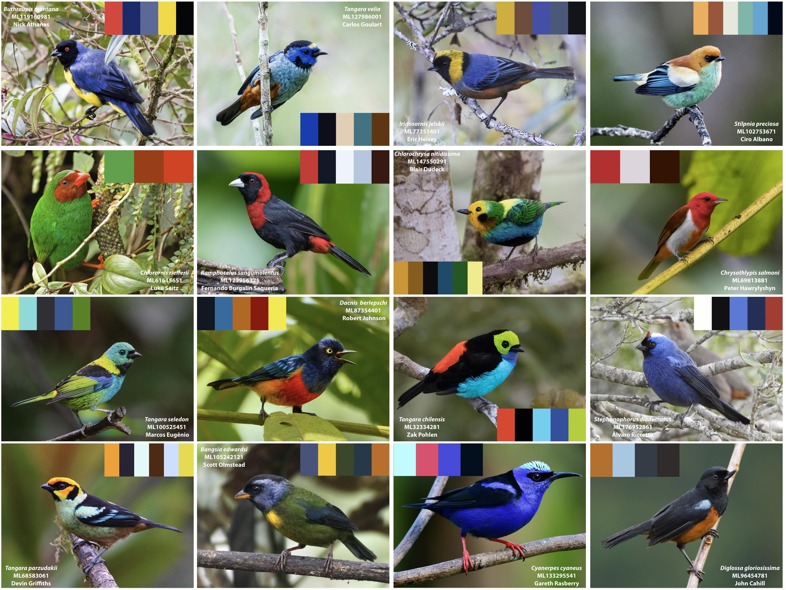

# tanagR: plumage-inspired color palettes for R

by [Felipe Zapata](https://github.com/zapataf) and [C. Daniel Cadena](https://github.com/cdanielcadena)

## Introduction

Sexual selection and natural selection have produced the most beautiful color palettes in the plumage of birds over millions of years of evolution - so why reinvent the (color) wheel? `tanagR` is an R package to generate color palettes for graphs inspired by the plumage of passerine birds in the tanager family (Thraupidae). The package currently includes 16 palettes based on colors from 16 species.

## Installation

`tanagR` is currently available only through GitHub. We hope to make it available via [CRAN](https://cran.r-project.org/web/packages/available_packages_by_name.html) soon. To install `tanagR` via GitHub, you will need `devtools`

	install.packages("devtools")
	devtools::install_github("cdanielcadena/tanagR")

## How to use tanagR

The typical pipeline for using `tanagR` involves 3 steps:

1. Visualize color palettes to choose the one that fits your needs
2. Select a color palette from the available palettes
3. Use the selected color palette to construct `base R`-style plots or `ggplot2`-style plots

## Visualize available palettes

Load `tanagR` and visualize palettes

	library(tanagR)
	names(tanagr_palettes)

Visualize one of the palettes:

	viz_palette("bangsia_edwardsi")

## Use a color palette

To use with base R

	pal = tanagr_palette("bangsia_edwardsi")
	data(iris)
	plot(iris$Sepal.Width,
		iris$Sepal.Length,
		col = pal[as.numeric(iris$Species)],
		pch = 19)

	pal = tanagr_palette("dacnis_berlepschi", n = 100, discrete = FALSE)
	image(volcano,
			col = pal,
			main = "Colors: Dacnis berlepschi")

To use with ggplot2

	library(ggplot2)
	ggplot(iris, 
		aes(x = Sepal.Length, 
		    y = Petal.Length, 
		    color = Species)) + 
	geom_point(alpha = 0.5, size  = 3) + 
	geom_density2d() + 
	theme_bw(base_size=12) + 
	scale_color_tanagr(palette_name = "stilpnia_preciosa")

	ggplot(iris, 
		aes(x = Sepal.Width, 
		    y = Sepal.Length, 
		    color = Petal.Width)) + 
	geom_point(alpha = 0.6, size  = 4) +  
	theme_bw(base_size=12) + 
	scale_color_tanagr(palette_name = "chlorochrysa_nitidissima", 
	                   discrete = FALSE)

	ggplot(mpg, 
		aes(manufacturer, 
		    fill = manufacturer)) + 
	geom_bar() + 
	theme(axis.text.x = element_text(angle = 45, hjust = 1), 
	      panel.background = element_blank()) + 
	scale_fill_tanagr(palette = "stilpnia_preciosa", 
	                  guide = "none")

## Issues

Please use the [issue tracker](https://github.com/cdanielcadena/tanagR/issues) to file issues.

## Plans for the future

* More color palettes
* Color-blind friendly palettes
* Automatic generation of color palette given a bird name, extendable to species in other families

## Credits

Thanks to [Karthik Ram](https://github.com/karthik) for releasing his `wesanderson` library under MIT license.
All photographs used to generate palettes were obtained from [The Macaulay Library at the Cornell Lab of Ornithology.](https://www.macaulaylibrary.org)
